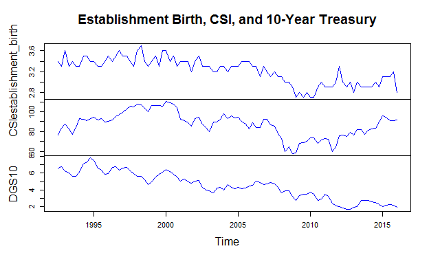

# Forecasting New Firm Growth
Sam Veverka  
20 March 2017  


#Introduction

Entrepreneurship has been a popular topic of discussion in the United States for the past few decades. Much media attention has been directed at the perceived center of entrepreneurship, Silicon Valley. The attention makes sense. Stories of small, garage tech companies flourishing into multi-billion behemoths captures the imagination. Given the spotlight shown on Silicon Valley and its disrupters, one would assume that entrepreneurship, quantified in this paper by the number of new establishments entering the economy, would be on the rise. The opposite is true. The creation of new businesses has been on the decline in the U.S. for thirty five years .

What drives new establishment growth, and hence entrepreneurship in the United States? Among the variables possibly explaining movement in new business growth, this paper singles out two which I believe significant, consumer confidence and interest rates. Consumer confidence or sentiment indices track the attitudes of persons in the economy towards the current business and economic climate. If the index is low, persons are pessimistic about the economic future and theoretically less likely to start a business. Interest rates play a more obvious role in the creation of new business. If interest rates drop, loans become relatively less expensive for the borrower. Most entrepreneurs need substantial loans to start a business, so when interest rates are low, new business growth should be relatively high.

So if movements in new business growth can be explained by consumer confidence and interest rates, one should be able to forecast movements in business growth using consumer confidence and interest rates. This paper attempts to do that.

#Load Libraries


```r
#load packages
library(forecast)
```

```
## Loading required package: zoo
```

```
## 
## Attaching package: 'zoo'
```

```
## The following objects are masked from 'package:base':
## 
##     as.Date, as.Date.numeric
```

```
## Loading required package: timeDate
```

```
## This is forecast 7.3
```

```r
library(vars)
```

```
## Loading required package: MASS
```

```
## Loading required package: strucchange
```

```
## Loading required package: sandwich
```

```
## Loading required package: urca
```

```
## Loading required package: lmtest
```

```r
library(tseries)
```

#Import Data and Convert to Time Series


There are not really good proxies for entrepreneurship outside of new business growth and for new business growth data sets are limited. The metric I use is the quarterly national establishment birth rate which is the number of newly created establishments as a percentage of total establishments. The rate of establishment birth is provided by the Bureau of Labor Statistics and has only been calculated since Q3 1992 to the present. Historical new business growth is the limiting factor in this model, so all data will be over the period of Q3 1992 to Q1 2016.

```r
#Establishment Birth - seasonally adjusted
est_birth_adj <- read.csv("Establishment_Birth_adj.csv",header=TRUE)
establishment_birth <- ts(data=est_birth_adj,start=c(1992,3),frequency=4) #ts function converts data to time series data, which is useful for VARs forecasting interprebility
```

Consumer confidence numbers are from the University of Michigan’s Consumer Sentiment Index. The index runs from 1952 to the current day and has a normalized value of 100 based on 1964 . The index is formed from data collected in telephone interviews meant to assess consumers’ attitudes on the future of the economy. The index is published monthly, but I have converted it to quarterly data by simple averaging

```r
#University of Michigan Consumer sentiment index
CSI_1 <- read.csv("UMCSENT.csv",header=TRUE)
CSI <- ts(data=CSI_1,start=c(1992,3),frequency=4)
```


The 10-Year Treasury Constant Maturity Rate, provided by the Federal Reserve System, is used to measure the change in interest rates. The 10-Year Treasury Constant Maturity Rate is an index of the yields of all Treasury securities, normalized to the benchmark 10-year rate. Obviously, businesses will borrow at business loan rates, not the treasury rate, but movements in the treasury security rate mirror movements in business loan rates reasonably well.

```r
#10-Year Treasury Constant Maturity Rate
DGS10_1 <- read.csv("DGS10.csv",header=TRUE)
DGS10 <- ts(data=DGS10_1,start=c(1992,3),frequency=4)
```


#Methodology
VAR models will be used to recursively forecast new establishment growth. There are 3 different VAR specifications, two bivariate models and a trivariate model encompassing the bivariate models.  All models will have new establishment births as the dependent variable and lagged establishment births as an independent variable or variables. The bivariate models will be a combination of lagged establishment births with lagged consumer confidence and lagged interest rates. The trivariate model will include all three lagged values as independent variables.


```r
#Create 3 VAR system
var_1 <- ts(cbind(establishment_birth,CSI),start=c(1992,3),frequency=4) #Establishment Birth and consumer sentiment
var_2 <- ts(cbind(establishment_birth,DGS10),start=c(1992,3),frequency=4) #Establishment Birth and 10-Year Treasury Constant Maturity Rate
var_3 <- ts(cbind(establishment_birth,CSI, DGS10),start=c(1992,3),frequency=4) #stock returns, consumer sentiment and 10-Year Treasury Constant Maturity Rate
```

Once the model is specified, I will recursively forecast new establishment births. The period of 1992:Q3 – 2012:Q4 will be used for the sample, and the period of 2013:Q1 – 2016:Q1 will be forecasted with all three VAR models. I believe through 2012 is a good ending point for the sample space as it captures the Great Recession and most of the bounce back from it. The results will be compared amongst each other and against an AR(1) benchmark, which regresses new establishment births on lagged new establishment births. The forecasts will be compared with the appropriate nested and non-nested comparison tests.

#Specification Results


To find the correct specification, I start by checking to verify that the new establishment births series is covariance stationary via the Augmented Dickey Fuller test and the Phillips-Perron Unit Root Test.

```r
#Run Augmented Dickey-Fuller(ADF) and Phillips-Perron tests for unit root
pp.test(establishment_birth)
```

```
## Warning in pp.test(establishment_birth): p-value smaller than printed p-
## value
```

```
## 
## 	Phillips-Perron Unit Root Test
## 
## data:  establishment_birth
## Dickey-Fuller Z(alpha) = -36.588, Truncation lag parameter = 3,
## p-value = 0.01
## alternative hypothesis: stationary
```

```r
adf.test(establishment_birth)
```

```
## 
## 	Augmented Dickey-Fuller Test
## 
## data:  establishment_birth
## Dickey-Fuller = -2.2017, Lag order = 4, p-value = 0.4931
## alternative hypothesis: stationary
```
The two test produced conflicting results. The ADF had a p-value of .49, which implies non-stationarity, and the Phillips-Perron had a p-value of .01, which implies stationarity. Given these results, I did not first-difference establishment births, as change in the percentage of establishment births does not provide as much economic insight as change in the level set. 

It can be helpful to observe a plot of the time series which will make up the VAR models. If the series are plotted side-by-side, possible similarities or differences can become apparent before running any actual tests. In the plot provided below, the three series do move together. I would expect CSI and establishment births to move together, but not interest rates and establishment births.


```r
#Plot variables
layout(1)
plot(var_3,type="l",col="blue",main="Establishment Birth, CSI, and 10-Year Treasury")
```

<!-- -->

Following identifying the level of stationarity in the dependent variable, I can use model selection criteria to find the appropriate number of lagged independent variables to use in the three VAR system.


```r
# find optimal number of lags
info.crit1 <- VARselect(var_1,lag.max=4,type="const")
info.crit2 <- VARselect(var_2,lag.max=4,type="const")
info.crit3 <- VARselect(var_3,lag.max=4,type="const")

info.crit1
```

```
## $selection
## AIC(n)  HQ(n)  SC(n) FPE(n) 
##      1      1      1      1 
## 
## $criteria
##                 1          2          3          4
## AIC(n) -1.0899329 -1.0886688 -1.0877633 -1.0426955
## HQ(n)  -1.0231433 -0.9773528 -0.9319209 -0.8423267
## SC(n)  -0.9243817 -0.8127502 -0.7014772 -0.5460420
## FPE(n)  0.3362551  0.3367390  0.3371746  0.3529609
```

```r
info.crit2
```

```
## $selection
## AIC(n)  HQ(n)  SC(n) FPE(n) 
##      3      1      1      3 
## 
## $criteria
##                   1            2            3            4
## AIC(n) -6.104581000 -6.139326850 -6.162113532 -6.103101624
## HQ(n)  -6.037791412 -6.028010869 -6.006271159 -5.902732858
## SC(n)  -5.939029824 -5.863408223 -5.775827455 -5.606448095
## FPE(n)  0.002232723  0.002156853  0.002109078  0.002238825
```

```r
info.crit3
```

```
## $selection
## AIC(n)  HQ(n)  SC(n) FPE(n) 
##      1      1      1      1 
## 
## $criteria
##                  1           2           3           4
## AIC(n) -3.17458293 -3.14257570 -3.08715227 -3.02163496
## HQ(n)  -3.04100375 -2.90881214 -2.75320433 -2.58750264
## SC(n)  -2.84348058 -2.56314659 -2.25939639 -1.94555232
## FPE(n)  0.04181865  0.04321092  0.04575387  0.04900997
```

The BIC was uniformly lowest for all three VAR models at 1 lag. Given the number of lags, the VAR equations can be written as so:

VAR Model 1	est_birtht = αt + β1est_birtht-1 + φ1CSIt-1 + εt

VAR Model 2	est_birtht = αt + β1est_birth + γ1DGS10t-1 + εt

VAR Model 3	est_birtht = αt + β1est_birtht-1 + φ1CSIt-1 + γ1DGS10t-1 + εt

Now that the VAR system is specified, we can estimate the VAR models and check for Granger causality. 

```r
# estimate VAR(1)
model1 <- VAR(var_1,p=1,type="const")
summary(model1)
```

```
## 
## VAR Estimation Results:
## ========================= 
## Endogenous variables: establishment_birth, CSI 
## Deterministic variables: const 
## Sample size: 94 
## Log Likelihood: -212.298 
## Roots of the characteristic polynomial:
## 0.9308 0.6479
## Call:
## VAR(y = var_1, p = 1, type = "const")
## 
## 
## Estimation results for equation establishment_birth: 
## ==================================================== 
## establishment_birth = establishment_birth.l1 + CSI.l1 + const 
## 
##                        Estimate Std. Error t value Pr(>|t|)    
## establishment_birth.l1 0.680420   0.084577   8.045 3.09e-12 ***
## CSI.l1                 0.004423   0.001653   2.676  0.00884 ** 
## const                  0.637792   0.189121   3.372  0.00110 ** 
## ---
## Signif. codes:  0 '***' 0.001 '**' 0.01 '*' 0.05 '.' 0.1 ' ' 1
## 
## 
## Residual standard error: 0.1306 on 91 degrees of freedom
## Multiple R-Squared: 0.7287,	Adjusted R-squared: 0.7228 
## F-statistic: 122.2 on 2 and 91 DF,  p-value: < 2.2e-16 
## 
## 
## Estimation results for equation CSI: 
## ==================================== 
## CSI = establishment_birth.l1 + CSI.l1 + const 
## 
##                        Estimate Std. Error t value Pr(>|t|)    
## establishment_birth.l1  1.84333    3.02314   0.610    0.544    
## CSI.l1                  0.89827    0.05908  15.204   <2e-16 ***
## const                   3.08893    6.76001   0.457    0.649    
## ---
## Signif. codes:  0 '***' 0.001 '**' 0.01 '*' 0.05 '.' 0.1 ' ' 1
## 
## 
## Residual standard error: 4.667 on 91 degrees of freedom
## Multiple R-Squared: 0.8633,	Adjusted R-squared: 0.8603 
## F-statistic: 287.3 on 2 and 91 DF,  p-value: < 2.2e-16 
## 
## 
## 
## Covariance matrix of residuals:
##                     establishment_birth     CSI
## establishment_birth             0.01705  0.1909
## CSI                             0.19091 21.7821
## 
## Correlation matrix of residuals:
##                     establishment_birth    CSI
## establishment_birth              1.0000 0.3133
## CSI                              0.3133 1.0000
```

```r
model2 <- VAR(var_2,p=1,type="const")
summary(model2)
```

```
## 
## VAR Estimation Results:
## ========================= 
## Endogenous variables: establishment_birth, DGS10 
## Deterministic variables: const 
## Sample size: 94 
## Log Likelihood: 24.043 
## Roots of the characteristic polynomial:
## 0.9799 0.5917
## Call:
## VAR(y = var_2, p = 1, type = "const")
## 
## 
## Estimation results for equation establishment_birth: 
## ==================================================== 
## establishment_birth = establishment_birth.l1 + DGS10.l1 + const 
## 
##                        Estimate Std. Error t value Pr(>|t|)    
## establishment_birth.l1  0.63622    0.08391   7.582 2.78e-11 ***
## DGS10.l1                0.04360    0.01297   3.362  0.00113 ** 
## const                   0.96882    0.22913   4.228 5.60e-05 ***
## ---
## Signif. codes:  0 '***' 0.001 '**' 0.01 '*' 0.05 '.' 0.1 ' ' 1
## 
## 
## Residual standard error: 0.1279 on 91 degrees of freedom
## Multiple R-Squared: 0.7397,	Adjusted R-squared: 0.734 
## F-statistic: 129.3 on 2 and 91 DF,  p-value: < 2.2e-16 
## 
## 
## Estimation results for equation DGS10: 
## ====================================== 
## DGS10 = establishment_birth.l1 + DGS10.l1 + const 
## 
##                        Estimate Std. Error t value Pr(>|t|)    
## establishment_birth.l1  0.35106    0.24308   1.444    0.152    
## DGS10.l1                0.93535    0.03757  24.895   <2e-16 ***
## const                  -0.88942    0.66379  -1.340    0.184    
## ---
## Signif. codes:  0 '***' 0.001 '**' 0.01 '*' 0.05 '.' 0.1 ' ' 1
## 
## 
## Residual standard error: 0.3705 on 91 degrees of freedom
## Multiple R-Squared: 0.947,	Adjusted R-squared: 0.9458 
## F-statistic: 812.3 on 2 and 91 DF,  p-value: < 2.2e-16 
## 
## 
## 
## Covariance matrix of residuals:
##                     establishment_birth    DGS10
## establishment_birth            0.016358 0.007255
## DGS10                          0.007255 0.137285
## 
## Correlation matrix of residuals:
##                     establishment_birth  DGS10
## establishment_birth              1.0000 0.1531
## DGS10                            0.1531 1.0000
```

```r
model3 <- VAR(var_3,p=1,type="const")
summary(model3)
```

```
## 
## VAR Estimation Results:
## ========================= 
## Endogenous variables: establishment_birth, CSI, DGS10 
## Deterministic variables: const 
## Sample size: 94 
## Log Likelihood: -239.981 
## Roots of the characteristic polynomial:
## 0.9769 0.8952 0.4206
## Call:
## VAR(y = var_3, p = 1, type = "const")
## 
## 
## Estimation results for equation establishment_birth: 
## ==================================================== 
## establishment_birth = establishment_birth.l1 + CSI.l1 + DGS10.l1 + const 
## 
##                        Estimate Std. Error t value Pr(>|t|)    
## establishment_birth.l1 0.458732   0.101329   4.527 1.82e-05 ***
## CSI.l1                 0.004510   0.001557   2.896 0.004741 ** 
## DGS10.l1               0.044174   0.012475   3.541 0.000634 ***
## const                  1.145057   0.228611   5.009 2.71e-06 ***
## ---
## Signif. codes:  0 '***' 0.001 '**' 0.01 '*' 0.05 '.' 0.1 ' ' 1
## 
## 
## Residual standard error: 0.123 on 90 degrees of freedom
## Multiple R-Squared: 0.7619,	Adjusted R-squared: 0.754 
## F-statistic:    96 on 3 and 90 DF,  p-value: < 2.2e-16 
## 
## 
## Estimation results for equation CSI: 
## ==================================== 
## CSI = establishment_birth.l1 + CSI.l1 + DGS10.l1 + const 
## 
##                        Estimate Std. Error t value Pr(>|t|)    
## establishment_birth.l1  0.90831    3.86274   0.235    0.815    
## CSI.l1                  0.89864    0.05937  15.137   <2e-16 ***
## DGS10.l1                0.18631    0.47554   0.392    0.696    
## const                   5.22845    8.71481   0.600    0.550    
## ---
## Signif. codes:  0 '***' 0.001 '**' 0.01 '*' 0.05 '.' 0.1 ' ' 1
## 
## 
## Residual standard error: 4.689 on 90 degrees of freedom
## Multiple R-Squared: 0.8635,	Adjusted R-squared: 0.859 
## F-statistic: 189.8 on 3 and 90 DF,  p-value: < 2.2e-16 
## 
## 
## Estimation results for equation DGS10: 
## ====================================== 
## DGS10 = establishment_birth.l1 + CSI.l1 + DGS10.l1 + const 
## 
##                          Estimate Std. Error t value Pr(>|t|)    
## establishment_birth.l1  0.3585849  0.3069184   1.168    0.246    
## CSI.l1                 -0.0001912  0.0047171  -0.041    0.968    
## DGS10.l1                0.9353298  0.0377848  24.754   <2e-16 ***
## const                  -0.8968863  0.6924443  -1.295    0.199    
## ---
## Signif. codes:  0 '***' 0.001 '**' 0.01 '*' 0.05 '.' 0.1 ' ' 1
## 
## 
## Residual standard error: 0.3726 on 90 degrees of freedom
## Multiple R-Squared: 0.947,	Adjusted R-squared: 0.9452 
## F-statistic: 535.6 on 3 and 90 DF,  p-value: < 2.2e-16 
## 
## 
## 
## Covariance matrix of residuals:
##                     establishment_birth     CSI    DGS10
## establishment_birth            0.015130  0.1841 0.007395
## CSI                            0.184140 21.9867 0.508916
## DGS10                          0.007395  0.5089 0.138808
## 
## Correlation matrix of residuals:
##                     establishment_birth    CSI  DGS10
## establishment_birth              1.0000 0.3193 0.1614
## CSI                              0.3193 1.0000 0.2913
## DGS10                            0.1614 0.2913 1.0000
```

```r
model_ar =arima(establishment_birth ,order=c(1,0,0),method="ML")
summary(model_ar)
```

```
## 
## Call:
## arima(x = establishment_birth, order = c(1, 0, 0), method = "ML")
## 
## Coefficients:
##          ar1  intercept
##       0.8469     3.2046
## s.e.  0.0547     0.0846
## 
## sigma^2 estimated as 0.01775:  log likelihood = 56.07,  aic = -106.15
## 
## Training set error measures:
##                        ME      RMSE       MAE        MPE     MAPE    MASE
## Training set -0.002702846 0.1332106 0.1058483 -0.2634107 3.310854 1.01528
##                    ACF1
## Training set -0.2561042
```

```r
model_ar
```

```
## 
## Call:
## arima(x = establishment_birth, order = c(1, 0, 0), method = "ML")
## 
## Coefficients:
##          ar1  intercept
##       0.8469     3.2046
## s.e.  0.0547     0.0846
## 
## sigma^2 estimated as 0.01775:  log likelihood = 56.07,  aic = -106.15
```

Granger causality is determined below.

```r
#Granger Test the bivariate VARs
causality(model1,cause="establishment_birth")$Granger
```

```
## 
## 	Granger causality H0: establishment_birth do not Granger-cause
## 	CSI
## 
## data:  VAR object model1
## F-Test = 0.37178, df1 = 1, df2 = 182, p-value = 0.5428
```

```r
causality(model1,cause="CSI")$Granger
```

```
## 
## 	Granger causality H0: CSI do not Granger-cause
## 	establishment_birth
## 
## data:  VAR object model1
## F-Test = 7.1598, df1 = 1, df2 = 182, p-value = 0.008136
```

```r
causality(model2,cause="establishment_birth")$Granger
```

```
## 
## 	Granger causality H0: establishment_birth do not Granger-cause
## 	DGS10
## 
## data:  VAR object model2
## F-Test = 2.0857, df1 = 1, df2 = 182, p-value = 0.1504
```

```r
causality(model2,cause="DGS10")$Granger
```

```
## 
## 	Granger causality H0: DGS10 do not Granger-cause
## 	establishment_birth
## 
## data:  VAR object model2
## F-Test = 11.301, df1 = 1, df2 = 182, p-value = 0.000944
```

For the trivariate case, VAR Model 3, the coefficients on establishment birth, CSI, and the 10-Year Treasury are all significant at the 1% level of significance.The outcome of the Granger causality test as well as the VAR Model 3 coefficient’s significance are a favorable sign and perhaps indicate that the VAR models have marginal predictive power and may forecast better, or at least as well as a simple AR(1) model.

#Forecast Results
As mentioned earlier, recursive forecasting will be used. The period of 1992:Q3 – 2012:Q4 is the sample for the four models (including the AR(1) model), and the period of 2013:Q1 – 2016:Q1 will be forecasted. The sample is reasonably large, 95 observations, with 82 of those being used as the sample period. Since the sample is reasonably large, I forecasted 1, 2, 3 and 4-steps-ahead. 4-step-ahead is meaningful in this case as the data is quarterly so 4-step-ahead completes a full year.

The loop used to forecast is below:

```r
##Recursive forecasting from 2013:Q1-2016:Q1
#Comparing forecasts from the 3 VAR(1) MODELS and the AR(1) MODEL
#Initial sample estimation 1993:Q3-2012:Q4 (sample size=82)

n.end = 82 #Initial sample estimation
t = length(establishment_birth) #Full Sample size
n = t-n.end - 3 #Forecast sample

# set matrix for storage
pred_var_1 <- matrix(rep(0,4*n),n,4)
pred_var_2 <- matrix(rep(0,4*n),n,4)
pred_var_3 <- matrix(rep(0,4*n),n,4)
pred_ar <- matrix(rep(0,4*n),n,4)

# start loop
for(i in 1:n){
  x_var_1 = var_1[1:n.end+i-1,]
  x_var_2 = var_2[1:n.end+i-1,]
  x_var_3 = var_3[1:n.end+i-1,]
  x_ar = establishment_birth[1:n.end+i-1]
  
  model_var_1=VAR(x_var_1,p=1,type="const")
  for_var_1=predict(model_var_1,n.ahead=4,se.fit=FALSE)
  pred_var_1[i,1:4]=for_var_1$fcst$establishment_birth[1:4] 
  
  model_var_2 =VAR(x_var_2,p=1,type="const")
  for_var_2=predict(model_var_2,n.ahead=4,se.fit=FALSE)
  pred_var_2[i,1:4]=for_var_2$fcst$establishment_birth[1:4] 
  
  model_var_3 =VAR(x_var_3,p=1,type="const")
  for_var_3=predict(model_var_3,n.ahead=4,se.fit=FALSE)
  pred_var_3[i,1:4]=for_var_3$fcst$establishment_birth[1:4] 
  
  model_ar=arima(x_ar,order=c(1,0,0),method="ML")
  pred_ar[i,1:4]=predict(model_ar,n.ahead=4,se.fit=FALSE)[1:4]
}
```


We now want to convert forecast results to time series objects.

```r
# set predictions as time series object
pred_var_1_ts=ts(data=pred_var_1,start=c(2013,1),frequency=4)
pred_var_2_ts=ts(data=pred_var_2,start=c(2013,1),frequency=4)
pred_var_3_ts=ts(data=pred_var_3,start=c(2013,1),frequency=4)
pred_ar_ts=ts(data=pred_ar,start=c(2013,1),frequency=4)
act_ts=ts(data=est_birth_adj[83:92,1],start=c(2013,1),frequency=4)
dim(est_birth_adj)
```

```
## [1] 95  1
```


We can gauge the results by observing a plot of the forecast results.

```r
# plot actual JOBS GROWTH and 1-step ahead forecasts
plot(x = act_ts,col="black",ylim=c(2.5,3.7),ylab = "Births as a % of Total Establishments")
lines(pred_var_1_ts[,1],col="green")
lines(pred_var_2_ts[,1],col="red")
lines(pred_var_3_ts[,1],col="yellow")
lines(pred_ar_ts[,1],col="purple")
abline(h=0)
legend(x="topright",c("Establishment Births","VAR 1 Forecast","VAR 2 Forecast", "VAR 3 Forecast","AR(1) Forecast"), ncol = 2,
       col=c("black","green","red", "yellow","purple"),lty=1,lwd=.5)
title(main = "Actual Establishment Births and 1-Step-Ahead Forecasts")
```

<!-- -->

```r
# plot actual JOBS GROWTH and 1-step ahead forecasts
plot(act_ts,col="black",ylim=c(2.5,3.7),ylab = "Births as a % of Total Establishments")
lines(pred_var_1_ts[,4],col="green")
lines(pred_var_2_ts[,4],col="red")
lines(pred_var_3_ts[,4],col="yellow")
lines(pred_ar_ts[,4],col="purple")
abline(h=0)
legend(x="topright",c("Establishment Births","VAR 1 Forecast","VAR 2 Forecast", "VAR 3 Forecast","AR(1) Forecast"), ncol = 2,
       col=c("black","green","red", "yellow","purple"),lty=1,lwd=.8)
title(main = "Actual Establishment Births and 4-Step-Ahead Forecasts")
```

<!-- -->

Plotted are the 1 and 4-steps-ahead forecast. The results are as expected. The 1-step-ahead chart shows the forecast reacting to what had happened 1 period prior. The 4-step-ahead forecast is smoother. Looking at the 4-Step-Ahead forecast, the VAR Model 3 Forecast appears to be superior, as graphically it travels right through the middle of the actual data’s peaks and valleys.

To compare the models forecasting ability, it is helpful to look at the generated root-mean-square error. Doing so will allow us to at least eye-ball whether the inclusion of CSI and/or interest rate data will help forecasting.

So calculate the prediction errors and then the root-mean-squared errors


```r
# prediction errors
# compute prediction errors
e1_var_1=establishment_birth[(n.end+1):(t-3)]-pred_var_1[,1]#1-step ahead error
e2_var_1=establishment_birth[(n.end+2):(t-2)]-pred_var_1[,2]#2-step ahead error
e3_var_1=establishment_birth[(n.end+3):(t-1)]-pred_var_1[,3]#3-step ahead error
e4_var_1=establishment_birth[(n.end+4):t]-pred_var_1[,4]#4-step ahead error

e1_var_2=establishment_birth[(n.end+1):(t-3)]-pred_var_2[,1]#1-step ahead error
e2_var_2=establishment_birth[(n.end+2):(t-2)]-pred_var_2[,2]#2-step ahead error
e3_var_2=establishment_birth[(n.end+3):(t-1)]-pred_var_2[,3]#3-step ahead error
e4_var_2=establishment_birth[(n.end+4):t]-pred_var_2[,4]#4-step ahead error

e1_var_3=establishment_birth[(n.end+1):(t-3)]-pred_var_3[,1]#1-step ahead error
e2_var_3=establishment_birth[(n.end+2):(t-2)]-pred_var_3[,2]#2-step ahead error
e3_var_3=establishment_birth[(n.end+3):(t-1)]-pred_var_3[,3]#3-step ahead error
e4_var_3=establishment_birth[(n.end+4):t]-pred_var_3[,4]#4-step ahead error

e1_ar=establishment_birth[(n.end+1):(t-3)]-pred_ar[,1]#1-step ahead error
e2_ar=establishment_birth[(n.end+2):(t-2)]-pred_ar[,2]#2-step ahead error
e3_ar=establishment_birth[(n.end+3):(t-1)]-pred_ar[,3]#3-step ahead error
e4_ar=establishment_birth[(n.end+4):t]-pred_ar[,4]#4-step ahead error

# compute root mean squared errors
rmse1_var_1=sqrt(mean(e1_var_1^2))
rmse2_var_1=sqrt(mean(e2_var_1^2))
rmse3_var_1=sqrt(mean(e3_var_1^2))
rmse4_var_1=sqrt(mean(e4_var_1^2))

rmse1_var_2=sqrt(mean(e1_var_2^2))
rmse2_var_2=sqrt(mean(e2_var_2^2))
rmse3_var_2=sqrt(mean(e3_var_2^2))
rmse4_var_2=sqrt(mean(e4_var_2^2))

rmse1_var_3=sqrt(mean(e1_var_3^2))
rmse2_var_3=sqrt(mean(e2_var_3^2))
rmse3_var_3=sqrt(mean(e3_var_3^2))
rmse4_var_3=sqrt(mean(e4_var_3^2))

rmse1_ar=sqrt(mean(e1_ar^2))
rmse2_ar=sqrt(mean(e2_ar^2))
rmse3_ar=sqrt(mean(e3_ar^2))
rmse4_ar=sqrt(mean(e4_ar^2))

#Print out RMSE results
rmse1_var_1; rmse2_var_1;rmse3_var_1;rmse4_var_1;
```

```
## [1] 0.1241354
```

```
## [1] 0.1101273
```

```
## [1] 0.1294002
```

```
## [1] 0.1947392
```

```r
rmse1_var_2; rmse2_var_2;rmse3_var_2;rmse4_var_2;
```

```
## [1] 0.109336
```

```
## [1] 0.09004612
```

```
## [1] 0.1181076
```

```
## [1] 0.1338015
```

```r
rmse1_var_3; rmse2_var_3;rmse3_var_3;rmse4_var_3;
```

```
## [1] 0.1028305
```

```
## [1] 0.07095981
```

```
## [1] 0.07993336
```

```
## [1] 0.1356435
```

```r
rmse1_ar; rmse2_ar;rmse3_ar;rmse4_ar;
```

```
## [1] 0.1212719
```

```
## [1] 0.08589467
```

```
## [1] 0.1151693
```

```
## [1] 0.1713726
```

It appears that overall the RMSE for VAR Model 3, the model including lagged versions of all variables on the right side, is the superior model. VAR Model 3 has a lower RMSE than all other models at every step ahead sans 4-step-ahead, for which VAR Model 2 has a lower RMSE.

Observing the RMSE values is good first step in comparing forecast, but it is not sufficient to declare a model superior. To rigorously decide the best model, I employ the Clark-West(CW) and Diebold-Mariano-West(DMW) comparison tests.

First, I started by comparing the two bivariate models to the AR(1) model. VAR Model 1, which included the consumer sentiment index, did not do better than the AR(1) Model at any time frame. 


```r
###- Clark-West Test for nested forecast comparison (VAR model with CSI with AR)
#1-step ahead
c=rep(1,n)
cw1 = e1_ar^2-e1_var_1^2+(e1_ar-e1_var_1)^2
reg.cw1 =lm(cw1 ~ c-1)
avar.cw1 =NeweyWest(reg.cw1,lag=3,prewhite=FALSE)
cw.test1=reg.cw1$coef/sqrt(avar.cw1)
cw.test1
```

```
##          c
## c 0.559169
```

```r
pnorm(cw.test1)
```

```
##           c
## c 0.7119768
```

```r
cwp1 <- (1-pnorm(cw.test1))/2

#2-step ahead
cw2 = e2_ar^2-e2_var_1^2+(e2_ar-e2_var_1)^2
reg.cw2 =lm(cw2~ c-1)
avar.cw2=NeweyWest(reg.cw2,lag=3,prewhite=FALSE)
cw.test2=reg.cw2$coef/sqrt(avar.cw2)
cw.test2
```

```
##            c
## c -0.2411677
```

```r
pnorm(cw.test2)
```

```
##           c
## c 0.4047126
```

```r
cwp2 <- (1-pnorm(cw.test2))/2

#3-step ahead
cw3 = e3_ar^2-e3_var_1^2+(e3_ar-e3_var_1)^2
reg.cw3 =lm(cw3~ c-1)
avar.cw3=NeweyWest(reg.cw3,lag=3,prewhite=FALSE)
cw.test3=reg.cw3$coef/sqrt(avar.cw3)
cw.test3
```

```
##           c
## c 0.2058616
```

```r
pnorm(cw.test3)
```

```
##           c
## c 0.5815505
```

```r
cwp3 <- (1-pnorm(cw.test3))/2

#4-step ahead
cw4 = e4_ar^2-e4_var_1^2+(e4_ar-e4_var_1)^2
reg.cw4 =lm(cw4~ c-1)
avar.cw4=NeweyWest(reg.cw4,lag=3,prewhite=FALSE)
cw.test4=reg.cw4$coef/sqrt(avar.cw4)
cw.test4
```

```
##          c
## c -0.66286
```

```r
pnorm(cw.test4)
```

```
##           c
## c 0.2537101
```

```r
cwp4 <- (1-pnorm(cw.test4))/2

#results for all 4
cwp1
```

```
##           c
## c 0.1440116
```

```r
cwp2
```

```
##           c
## c 0.2976437
```

```r
cwp3
```

```
##           c
## c 0.2092247
```

```r
cwp4
```

```
##           c
## c 0.3731449
```

VAR Model 2, which included 10-Year Treasury Index, was significantly better than the AR(1) Model for all step-ahead forecasts at the 10% level of significance, and better for the 1, 2, and 4-step ahead forecasts at the 5% level of significance.


```r
###- Clark-West Test for nested forecast comparison (VAR model with 10 year treasury with AR)
#1-step ahead
c=rep(1,n)
cw1 = e1_ar^2-e1_var_2^2+(e1_ar-e1_var_2)^2
reg.cw1 =lm(cw1 ~ c-1)
avar.cw1 =NeweyWest(reg.cw1,lag=3,prewhite=FALSE)
cw.test1=reg.cw1$coef/sqrt(avar.cw1)
cw.test1
```

```
##          c
## c 1.412129
```

```r
pnorm(cw.test1)
```

```
##           c
## c 0.9210441
```

```r
cwp1 <- (1-pnorm(cw.test1))/2

#2-step ahead
cw2 = e2_ar^2-e2_var_2^2+(e2_ar-e2_var_2)^2
reg.cw2 =lm(cw2~ c-1)
avar.cw2=NeweyWest(reg.cw2,lag=3,prewhite=FALSE)
cw.test2=reg.cw2$coef/sqrt(avar.cw2)
cw.test2
```

```
##          c
## c 1.293304
```

```r
pnorm(cw.test2)
```

```
##           c
## c 0.9020471
```

```r
cwp2 <- (1-pnorm(cw.test2))/2

#3-step ahead
cw3 = e3_ar^2-e3_var_2^2+(e3_ar-e3_var_2)^2
reg.cw3 =lm(cw3~ c-1)
avar.cw3=NeweyWest(reg.cw3,lag=3,prewhite=FALSE)
cw.test3=reg.cw3$coef/sqrt(avar.cw3)
cw.test3
```

```
##           c
## c 0.9815182
```

```r
pnorm(cw.test3)
```

```
##           c
## c 0.8368314
```

```r
cwp3 <- (1-pnorm(cw.test3))/2

#4-step ahead
cw4 = e4_ar^2-e4_var_2^2+(e4_ar-e4_var_2)^2
reg.cw4 =lm(cw4~ c-1)
avar.cw4=NeweyWest(reg.cw4,lag=3,prewhite=FALSE)
cw.test4=reg.cw4$coef/sqrt(avar.cw4)
cw.test4
```

```
##          c
## c 1.883007
```

```r
pnorm(cw.test4)
```

```
##           c
## c 0.9701503
```

```r
cwp4 <- (1-pnorm(cw.test4))/2

#results for all 4
cwp1
```

```
##            c
## c 0.03947797
```

```r
cwp2
```

```
##            c
## c 0.04897645
```

```r
cwp3
```

```
##            c
## c 0.08158432
```

```r
cwp4
```

```
##            c
## c 0.01492487
```

Now, I compare the two bivariate models

```r
#####Now compare the 2-bivariate models - Use DMW 
c=rep(1,n)

dmw1=e1_var_2^2-e1_var_1^2
dmw2=e2_var_2^2-e2_var_1^2
dmw3=e3_var_2^2-e3_var_1^2
dmw4=e4_var_2^2-e4_var_1^2

#1-step Ahead
reg1=lm(dmw1~c-1)
avar1=NeweyWest(reg1,lag=3,prewhite=FALSE)
dmw.q1=reg1$coef/sqrt(avar1)#DMW STATISTIC
dmw.q1
```

```
##            c
## c -0.7887312
```

```r
pnorm(dmw.q1)
```

```
##           c
## c 0.2151346
```

```r
p.value1=1-pnorm(dmw.q1)
pstr.value1=p.value1/2 
pstr.value1 
```

```
##           c
## c 0.3924327
```

```r
#2-step Ahead
reg2=lm(dmw2~c-1)
avar2=NeweyWest(reg2,lag=3,prewhite=FALSE)
dmw.q2=reg2$coef/sqrt(avar2)#DMW STATISTIC
dmw.q2
```

```
##            c
## c -0.6254717
```

```r
pnorm(dmw.q2)
```

```
##           c
## c 0.2658308
```

```r
p.value2=1-pnorm(dmw.q2)
pstr.value2=p.value2/2 
pstr.value2
```

```
##           c
## c 0.3670846
```

```r
#3-step Ahead
reg3=lm(dmw3~c-1)
avar3=NeweyWest(reg3,lag=3,prewhite=FALSE)
dmw.q3=reg3$coef/sqrt(avar3)#DMW STATISTIC
dmw.q3
```

```
##            c
## c -0.1963345
```

```r
pnorm(dmw.q3)
```

```
##           c
## c 0.4221742
```

```r
p.value3=1-pnorm(dmw.q3)
pstr.value3=p.value3/2 
pstr.value3 
```

```
##           c
## c 0.2889129
```

```r
#4-step Ahead
reg4=lm(dmw4~c-1)
avar4=NeweyWest(reg4,lag=3,prewhite=FALSE)
dmw.q4=reg4$coef/sqrt(avar4)#DMW STATISTIC
dmw.q4
```

```
##           c
## c -1.153817
```

```r
pnorm(dmw.q4)
```

```
##           c
## c 0.1242876
```

```r
p.value4=1-pnorm(dmw.q4)
pstr.value4=p.value4/2 
pstr.value4
```

```
##           c
## c 0.4378562
```

```r
#P-values for all four
pstr.value1
```

```
##           c
## c 0.3924327
```

```r
pstr.value2
```

```
##           c
## c 0.3670846
```

```r
pstr.value3
```

```
##           c
## c 0.2889129
```

```r
pstr.value4
```

```
##           c
## c 0.4378562
```
Interestingly, according to the Diebold-Mariano-West test results, the bivariate VAR models are not significantly different. One would think that given the bivariate to AR(1) comparison tests that VAR Model 2 would be significantly better than VAR Model 1. Perhaps the different function forms between the Diebold-Mariano-West and Clark-West tests can explain the discrepancy.

Finally, I compare the  trivariate model with the two bivariate models and the AR model.


```r
####Compare the trivariate model with the CSI model. Use the Clark-West
c=rep(1,n)
cw1 = e1_var_1^2-e1_var_3^2+(e1_var_1-e1_var_3)^2
reg.cw1 =lm(cw1 ~ c-1)
avar.cw1 =NeweyWest(reg.cw1,lag=3,prewhite=FALSE)
cw.test1=reg.cw1$coef/sqrt(avar.cw1)
cw.test1
```

```
##          c
## c 2.334635
```

```r
pnorm(cw.test1)
```

```
##           c
## c 0.9902187
```

```r
cwp1 <- (1-pnorm(cw.test1))/2

#2-step ahead
cw2 = e2_var_1^2-e2_var_3^2+(e2_var_1-e2_var_3)^2
reg.cw2 =lm(cw2~ c-1)
avar.cw2=NeweyWest(reg.cw2,lag=3,prewhite=FALSE)
cw.test2=reg.cw2$coef/sqrt(avar.cw2)
cw.test2
```

```
##          c
## c 3.516282
```

```r
pnorm(cw.test2)
```

```
##           c
## c 0.9997812
```

```r
cwp2 <- (1-pnorm(cw.test2))/2

#3-step ahead
cw3 = e3_var_1^2-e3_var_3^2+(e3_var_1-e3_var_3)^2
reg.cw3 =lm(cw3~ c-1)
avar.cw3=NeweyWest(reg.cw3,lag=3,prewhite=FALSE)
cw.test3=reg.cw3$coef/sqrt(avar.cw3)
cw.test3
```

```
##          c
## c 2.243336
```

```r
pnorm(cw.test3)
```

```
##           c
## c 0.9875624
```

```r
cwp3 <- (1-pnorm(cw.test3))/2

#4-step ahead
cw4 = e4_var_1^2-e4_var_3^2+(e4_var_1-e4_var_3)^2
reg.cw4 =lm(cw4~ c-1)
avar.cw4=NeweyWest(reg.cw4,lag=3,prewhite=FALSE)
cw.test4=reg.cw4$coef/sqrt(avar.cw4)
cw.test4
```

```
##          c
## c 2.441123
```

```r
pnorm(cw.test4)
```

```
##           c
## c 0.9926792
```

```r
cwp4 <- (1-pnorm(cw.test4))/2

#results for all 4
cwp1
```

```
##             c
## c 0.004890627
```

```r
cwp2
```

```
##              c
## c 0.0001094091
```

```r
cwp3
```

```
##             c
## c 0.006218789
```

```r
cwp4
```

```
##             c
## c 0.003660419
```

```r
####Compare the trivariate model with the 10-Year Treasury model. Use the Clark-West
c=rep(1,n)
cw1 = e1_var_2^2-e1_var_3^2+(e1_var_2-e1_var_3)^2
reg.cw1 =lm(cw1 ~ c-1)
avar.cw1 =NeweyWest(reg.cw1,lag=3,prewhite=FALSE)
cw.test1=reg.cw1$coef/sqrt(avar.cw1)
cw.test1
```

```
##          c
## c 1.171393
```

```r
pnorm(cw.test1)
```

```
##           c
## c 0.8792796
```

```r
cwp1 <- (1-pnorm(cw.test1))/2

#2-step ahead
cw2 = e2_var_2^2-e2_var_3^2+(e2_var_2-e2_var_3)^2
reg.cw2 =lm(cw2~ c-1)
avar.cw2=NeweyWest(reg.cw2,lag=3,prewhite=FALSE)
cw.test2=reg.cw2$coef/sqrt(avar.cw2)
cw.test2
```

```
##          c
## c 1.405267
```

```r
pnorm(cw.test2)
```

```
##          c
## c 0.920029
```

```r
cwp2 <- (1-pnorm(cw.test2))/2

#3-step ahead
cw3 = e3_var_2^2-e3_var_3^2+(e3_var_2-e3_var_3)^2
reg.cw3 =lm(cw3~ c-1)
avar.cw3=NeweyWest(reg.cw3,lag=3,prewhite=FALSE)
cw.test3=reg.cw3$coef/sqrt(avar.cw3)
cw.test3
```

```
##          c
## c 1.368289
```

```r
pnorm(cw.test3)
```

```
##           c
## c 0.9143892
```

```r
cwp3 <- (1-pnorm(cw.test3))/2

#4-step ahead
cw4 = e4_var_2^2-e4_var_3^2+(e4_var_2-e4_var_3)^2
reg.cw4 =lm(cw4~ c-1)
avar.cw4=NeweyWest(reg.cw4,lag=3,prewhite=FALSE)
cw.test4=reg.cw4$coef/sqrt(avar.cw4)
cw.test4
```

```
##          c
## c 1.212417
```

```r
pnorm(cw.test4)
```

```
##           c
## c 0.8873236
```

```r
cwp4 <- (1-pnorm(cw.test4))/2

#results for all 4
cwp1
```

```
##            c
## c 0.06036021
```

```r
cwp2
```

```
##           c
## c 0.0399855
```

```r
cwp3
```

```
##            c
## c 0.04280538
```

```r
cwp4
```

```
##            c
## c 0.05633821
```

```r
####Compare the trivariate model with the AR model. Use the Clark-West
c=rep(1,n)
cw1 = e1_ar^2-e1_var_3^2+(e1_ar-e1_var_3)^2
reg.cw1 =lm(cw1 ~ c-1)
avar.cw1 =NeweyWest(reg.cw1,lag=3,prewhite=FALSE)
cw.test1=reg.cw1$coef/sqrt(avar.cw1)
cw.test1
```

```
##          c
## c 1.968688
```

```r
pnorm(cw.test1)
```

```
##           c
## c 0.9755055
```

```r
cwp1 <- (1-pnorm(cw.test1))/2

#2-step ahead
cw2 = e2_ar^2-e2_var_3^2+(e2_ar-e2_var_3)^2
reg.cw2 =lm(cw2~ c-1)
avar.cw2=NeweyWest(reg.cw2,lag=3,prewhite=FALSE)
cw.test2=reg.cw2$coef/sqrt(avar.cw2)
cw.test2
```

```
##          c
## c 1.984777
```

```r
pnorm(cw.test2)
```

```
##           c
## c 0.9764153
```

```r
cwp2 <- (1-pnorm(cw.test2))/2

#3-step ahead
cw3 = e3_ar^2-e3_var_3^2+(e3_ar-e3_var_3)^2
reg.cw3 =lm(cw3~ c-1)
avar.cw3=NeweyWest(reg.cw3,lag=3,prewhite=FALSE)
cw.test3=reg.cw3$coef/sqrt(avar.cw3)
cw.test3
```

```
##         c
## c 1.58831
```

```r
pnorm(cw.test3)
```

```
##           c
## c 0.9438919
```

```r
cwp3 <- (1-pnorm(cw.test3))/2

#4-step ahead
cw4 = e4_ar^2-e4_var_3^2+(e4_ar-e4_var_3)^2
reg.cw4 =lm(cw4~ c-1)
avar.cw4=NeweyWest(reg.cw4,lag=3,prewhite=FALSE)
cw.test4=reg.cw4$coef/sqrt(avar.cw4)
cw.test4
```

```
##          c
## c 1.759898
```

```r
pnorm(cw.test4)
```

```
##           c
## c 0.9607875
```

```r
cwp4 <- (1-pnorm(cw.test4))/2

#results for all 4
cwp1
```

```
##            c
## c 0.01224723
```

```r
cwp2
```

```
##            c
## c 0.01179233
```

```r
cwp3
```

```
##            c
## c 0.02805407
```

```r
cwp4
```

```
##            c
## c 0.01960627
```
The trivariate model (VAR Model 3) performs better than the VAR Model 1 at all steps ahead at the 5% level of significance. VAR Model 3 performs better than VAR Model 2 at the 2 and 3-steps-ahead at the 5% level of significance and 1 and 4-steps-aheads at the 5% level of significance. The trivariate model performs better than the AR(1) model at the 5% level of significance and almost at the 1% level of significance.

#Conclusion
Given the comparison test results, it appears that the VAR Model 3, the model including both the consumer sentiment index and the 10-Year Treasury Constant Maturity Rate, is best out of the VAR models tested in this paper in forecasting future values of new establishment births. VAR Model 3 is also significantly better than a simple AR(1) model.

The results are intriguing, because as seen earlier when observing the time series, the establishment birth rate moved with the consumer sentiment index and the 10-Year Treasury rate pretty well. I would expect establishment birth rate to move with CSI, as when the economy is doing poorly one would expect consumers to have low confidence in the economy. If the economy is doing poorly, persons, who are also consumers with low confidence, are probably unlikely to start new businesses. The 10-Year Treasury moves with establishment birth rate as well instead of opposite of it, which still helps forecasting but does not support my hypothesis that low interest rates broadly would correspond to higher establishment birth rates. Apparently, the connection between interest rates and new business growth is not so clear cut. 


---
